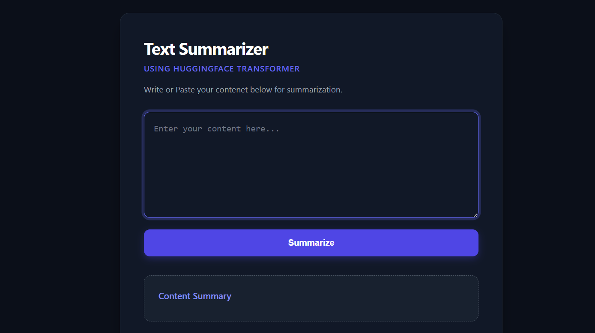

<div align="center">

# Text Summarizer using Hugging Face Transformers

[](https://python.org)
[](https://huggingface.co/)
[](https://pytorch.org)
[](https://fastapi.tiangolo.com/)
[](https://huggingface.co/datasets/samsum)

> A complete NLP application that fine-tunes the **T5-Small Transformer** for dialogue summarization using the **SAMSum dataset** and deploys it through a **FastAPI-powered web application**.

</div>

---

# 🎯 Project Overview

This project demonstrates how to fine-tune a Transformer model for abstractive text summarization using Hugging Face Transformers.

The application accepts long conversations or dialogues as input and automatically generates concise summaries using a fine-tuned **T5-Small** model.

To make the model accessible through a simple interface, the trained model is integrated with a **FastAPI backend** and a clean HTML/CSS/JavaScript frontend.

The project covers the complete NLP workflow:

- Data preprocessing
- Transformer tokenization
- Fine-tuning T5-Small
- Model evaluation
- Model saving
- FastAPI deployment
- Interactive web interface

---

# 📖 What is Text Summarization?

Text Summarization is a Natural Language Processing (NLP) task that automatically generates a shorter version of a document while preserving its key information.

There are two major approaches:

- **Extractive Summarization** – Selects important sentences directly from the text.
- **Abstractive Summarization** – Generates entirely new sentences that capture the meaning of the original content.

This project implements **Abstractive Text Summarization** using the **T5 Transformer**.

---

# 🤖 About the T5 Transformer

T5 (Text-To-Text Transfer Transformer) is one of Google's most popular Transformer models.

Unlike traditional NLP models, T5 converts every NLP task into a **text-to-text** problem.

Examples include:

- Translation
- Question Answering
- Summarization
- Classification
- Text Generation

For this project, T5-Small was fine-tuned specifically for dialogue summarization.

---

# 📊 Dataset Information

The project uses the **SAMSum Dialogue Summarization Dataset**, a benchmark dataset designed for training conversational summarization models.

### Dataset Details

| Property | Value |
|-----------|---------|
| Dataset | SAMSum |
| Task | Dialogue Summarization |
| Model | T5-Small |
| Problem Type | Abstractive Text Summarization |

The dataset consists of human conversations paired with high-quality reference summaries, making it well-suited for training dialogue summarization systems.

---

# 🖥️ Web Application Preview

<div align="center">



</div>

The web application allows users to:

- Paste long conversations
- Generate concise summaries
- View summarized output instantly
- Interact through a clean and responsive interface

---

# 🚀 Features

- Dialogue Summarization
- Hugging Face Transformers
- Fine-Tuned T5-Small Model
- FastAPI Backend
- Interactive Web Interface
- Beam Search Decoding
- Automatic Text Cleaning
- GPU / CPU Support
- REST API Endpoint
- Real-Time Summarization

---

# 🧠 Project Workflow

## Data Preparation

- Load SAMSum Dataset
- Clean Dialogue Text
- Tokenize Input and Target Sequences
- Prepare Training and Validation Sets

## Model Training

- Load Pretrained T5-Small
- Fine-Tune on Dialogue Summarization Task
- Optimize using Hugging Face Trainer
- Validate Model Performance

## Inference Pipeline

- Receive User Input
- Clean Dialogue
- Tokenize Input
- Generate Summary using Beam Search
- Decode Output Tokens
- Return Final Summary

## Deployment

- Load Fine-Tuned Model
- Serve Predictions using FastAPI
- Connect Backend with HTML Frontend
- Display Generated Summary

---

# 🏗️ Model Architecture

```text
Input Dialogue

        ↓

Text Cleaning

        ↓

T5 Tokenizer

        ↓

T5-Small Transformer

        ↓

Beam Search Decoder

        ↓

Generated Summary

        ↓

FastAPI Backend

        ↓

Web Interface
```

---

# ⚙️ Training Configuration

| Parameter | Value |
|------------|--------|
| Model | T5-Small |
| Framework | Hugging Face Transformers |
| Dataset | SAMSum |
| Epochs | 6 |
| Batch Size | 8 |
| Weight Decay | 0.01 |
| Warmup Steps | 500 |
| Max Input Length | 512 |
| Max Summary Length | 150 |
| Beam Search | 4 Beams |
| Backend | FastAPI |

---

# 📈 Training Results

| Epoch | Training Loss | Validation Loss |
|------:|--------------:|----------------:|
| 1 | 3.5946 | 0.3811 |
| 2 | 0.3972 | 0.3594 |
| 3 | 0.3746 | 0.3546 |
| 4 | 0.3618 | 0.3505 |
| 5 | 0.3559 | 0.3491 |
| 6 | 0.3508 | 0.3491 |

The model showed steady improvement during training, with both training and validation loss decreasing over six epochs. The fine-tuned T5-Small model was then integrated into a FastAPI application that generates summaries using beam search decoding. :contentReference[oaicite:0]{index=0}

---

# 🔍 Example Summarization

### Input Dialogue

> Alice: Hey! Are we still meeting tomorrow at 10 AM?  
> Bob: Yes, I'll be there. Don't forget to bring the project report.  
> Alice: Sure! See you tomorrow.

### Generated Summary

> Alice and Bob confirmed their meeting for tomorrow at 10 AM, and Bob reminded Alice to bring the project report.

# 📂 Project Structure

```text
Text-Summarizer-using-Hugging-Face-Transformers/
│
├── images/
│   └── homepage.png
│
├── saved_summary_model/
│
├── app.py
├── index.html
├── text_summarizer.ipynb
├── requirements.txt
├── .gitignore
└── README.md
```

---

# 🖥️ Run Locally

### 1. Clone the Repository

```bash
git clone https://github.com/harsh-v16/Text-Summarizer-using-Hugging-Face-Transformers.git

cd Text-Summarizer-using-Hugging-Face-Transformers
```

---

### 2. Install Dependencies

```bash
pip install -r requirements.txt
```

---

### 3. Launch the FastAPI Application

```bash
uvicorn app:app --reload
```

---

### 4. Open the Application

Visit:

```text
http://127.0.0.1:8000
```

Paste any conversation into the text area and click **Summarize** to generate an abstractive summary.

---


# 🛠️ Tech Stack

| Tool | Purpose |
|------|----------|
| Python | Programming Language |
| Hugging Face Transformers | Transformer Models |
| PyTorch | Deep Learning Framework |
| FastAPI | Backend Framework |
| HTML | User Interface |
| CSS | Styling |
| JavaScript | Frontend Interaction |
| Jinja2 | HTML Templates |
| SAMSum Dataset | Dialogue Summarization Dataset |
| GitHub | Version Control |

---

# 📚 Learning Outcomes

Through this project, I learned:

- Fine-Tuning Transformer Models
- Hugging Face Transformers Library
- Working with T5-Small
- Dialogue Summarization
- Text Tokenization
- Beam Search Decoding
- Model Saving and Loading
- FastAPI Backend Development
- Building REST APIs
- Connecting Backend with Frontend
- Deploying NLP Models
- End-to-End NLP Application Development

---

# 🎯 Key Concepts Demonstrated

- Natural Language Processing (NLP)
- Transformer Architecture
- Encoder-Decoder Models
- Abstractive Text Summarization
- Sequence-to-Sequence Learning
- Fine-Tuning Pretrained Models
- Beam Search
- Tokenization
- FastAPI Deployment
- Web-Based AI Applications

---

# 🔮 Future Improvements

- Deploy using Docker
- Deploy on Hugging Face Spaces
- Add User Authentication
- Support PDF and Document Uploads
- Multi-Language Summarization
- Batch Summarization
- Streamlit Version
- Gradio Interface
- Model Quantization for Faster Inference
- Fine-Tune Larger Transformer Models (T5-Base / BART)

---

# 📸 Results

The fine-tuned **T5-Small** model successfully generates concise summaries for conversational text.

The application demonstrates:

- High-quality dialogue summarization
- Fast inference using FastAPI
- Clean and responsive user interface
- Beam Search-based text generation
- End-to-End deployment of a Transformer model

The web application allows users to paste long conversations and receive summarized content within seconds.

---

# 🤝 Contributing

Contributions, suggestions, and improvements are always welcome.

If you'd like to improve this project or experiment with more advanced Transformer models, feel free to fork the repository and submit a pull request.

---

# 👤 Author

<div align="center">

**Harsh Chaudhary**

Computer Engineering Student | Machine Learning & Deep Learning Enthusiast

[](https://github.com/harsh-v16)

[](https://www.linkedin.com/in/harsh-chaudhary-6ba5b8395/)

</div>

---

<div align="center">

⭐ If you found this project useful, consider giving it a star!

</div>
